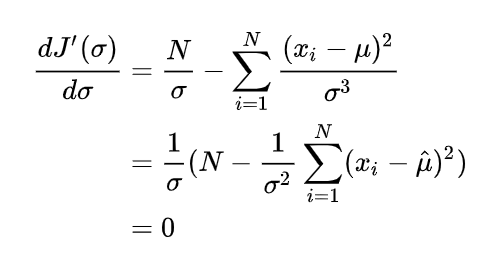
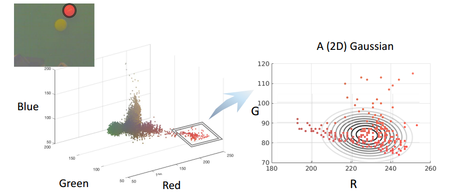

## Gaussian Model Learning

[从高斯分布、机器人误差、EM算法到小球检测 - 知乎 (zhihu.com)](https://zhuanlan.zhihu.com/p/21648507)

Coursera上的课程（[Robotics: Estimation and Learning](https://link.zhihu.com/?target=https%3A//www.coursera.org/learn/robotics-learning/home/week/1)），感觉讲得特别棒，写下自己的理解。

高斯分布被广泛应用于对机器人误差的建模。在这篇笔记中，我们将会：

- 介绍如何使用一元高斯分布、多元高斯分布和高斯混合模型对机器人误差进行建模。
- 介绍求解这些高斯分布的算法。
- 以小球检测这一实际应用来实践我们的模型和算法。

**1. 一元高斯分布**

在这一节我们将介绍如何使用一元高斯分布对机器人误差进行建模。

在进入正题之前，我们需要首先了解为什么学习高斯分布？什么使得高斯分布有效并且重要？为什么使用高斯分布对噪声和不确定性进行建模（而不是其他概率分布模型，比如均匀分布）？


- 高斯分布使得只需要两个参数就能确定一个连续的概率分布。这两个参数分别是均值和方差，这很简洁。这也使得高斯分布易于计算和推断。
- 高斯分布有一些较好的数学性质。例如，两个高斯分布的积还是高斯分布。这使得你在对高斯分布做运算的时候不需要考虑其他的概率分布。
- 理论上来说，根据中心极限定理，大量相互独立的随机变量，其均值的分布以高斯分布为极限。而噪声和不确定性就是包含大量相互独立的随机变量的数据，用高斯分布对它们进行建模是不二选择。

说了这么多，我们来举个栗子吧，怎样使用高斯分布来对一个目标颜色进行建模？

下图是足球机器人通过头顶摄像机拍摄到的照片。


显然，图片中有两种颜色的球，黄球和红球。我们设想这个足球机器人想检测图片中的黄球。对于人类来说，一眼就能分辨出黄球在哪，但对一个机器人来说这并不简单。机器人读入的图片是一个一个像素的数值，它需要建立从像素的数值到“黄色”或者“红色”的映射。不妨让我们来看看“黄球”里面的像素数值是怎样的。我们记录黄球的每个像素的色相值（Hue，[HSV模型](https://link.zhihu.com/?target=https%3A//zh.wikipedia.org/wiki/HSL%E5%92%8CHSV%E8%89%B2%E5%BD%A9%E7%A9%BA%E9%97%B4)中表示色彩的基本属性，就是平常所说的颜色名称，如红色、黄色等），然后画出每一个色相值出现次数的柱状图如右下。


我们可以看到，”黄色“这一种颜色可以有很多个色相值（换成RGB模型也是一样的），这就是我们所说的噪声或者不确定性。从分布上来看，”黄色“的色相值以大约53为中心然后向两边扩散。为了记录“黄色”，一种方法是记录每一个“黄色”像素的色相值，然而这将十分消耗存储空间，确切来说，有多少像素就消耗多大的空间。


另一种简洁有效的方法是使用高斯分布。

让我们先来温故一下高斯分布的数学表达形式再返回来解释这个例子吧。

高斯分布的数学形式如下：


其中，$$x$$ 是变量，$$p(x)$$ 表示 $$x$$ 的出现的概率，$$\mu$$是均值，$$\sigma$$ 是标准差（$$\sigma^2$$是方差)。$$\mu$$ 和 $$\sigma$$ 是之前我们提到的表示一个高斯分布的两个参数。

在我们上面的栗子中，假设我们已经完成了对黄色的高斯分布建模，$$x$$ 是一个采样像素的色相值，那么 $$p(x)$$ 就表示该像素属于“黄色”的概率。

我们继续介绍高斯分布，为了更加直观地了解高斯分布长什么样子，我们把高斯分布画出来。下图是 $$\mu=0, \sigma=1$$ 的情况下的高斯分布图（标准高斯分布）。


当均值变化而方差不变的时候，可以看作将图像进行了平移。


当均值不变，而标准差变化的时候，可以看作将图像进行了“挤”或“压”（方差越大越扁）。


总结来说，![[公式]](https://www.zhihu.com/equation?tex=%5Cmu)决定了高斯分布的对称轴，![[公式]](https://www.zhihu.com/equation?tex=%5Csigma)决定了高斯分布的扩散程度。


让我们返回到小球检测的栗子。我们只使用一个高斯分布（即两个值）就可以近似地存储所有的“黄色”像素，如下图。


那么如何通过数据来求 $$\mu$$和 $$\sigma$$ 这两个参数呢？我们将在下一节中介绍最大似然估计方法求解一元高斯分布。


### **2. 求解一元高斯分布：最大似然估计**

在这一节，我们将介绍使用最大似然估计（Maximum Likelihood Estimation，MLE）的方法来求解观测数据的一元高斯分布。

首先，我们引入似然函数（或者说似然，Likelihood）的概念。

似然指的是在给定模型参数的情况下观测值出现的概率。它被定义成了一个条件概率。
$$
p(\{x_i\} \ |\ \mu, \sigma )
$$
其中条件概率的定义为 (可以理解为 $$B$$ 为 Universal Set)
$$
p(A|B) = \frac{p(AB)}{p(B)}
$$
对于独立事件而言， 
$$
p(AB)= p(A)p(B) \\
$$
比如，在上一节的小球例子中，$$\{x_i\}$$ 表示所有“黄色”像素点的色相值，如果给定了高斯分布的 $$\mu$$ 和 $$\sigma$$，我们就能算出 $$\{x_i\}$$ 出现的概率。


(很容易理解， 在给定$$\mu, \sigma$$ 下就有了高斯模型， 如果此时输入 $$x_i$$ 的值，自然可以得到 $$p(x_i | \mu, \sigma)$$ ， 其中 $$p(x | \mu, \sigma)$$ 为高斯模型的函数)。 


那么我们的问题就可以表述为，给定观测值 $$\{x_i\}$$，求 $$\mu$$ 和 $$\sigma$$，，使得似然函数最大：


其中，$$\hat{\mu}$$ 和 $$\hat{\sigma}$$表示估计值。(不难理解，是想要**高斯模型的定义域**尽可能贴近 $$\{x_i\}$$ 的所有观察值)


(图二，比如偏离比较大时，可能只会覆盖一部分的模型, 因为 $$\{x_i\}$$ 的范围不变， 而模型会左右移动)。

这里，观测值$$\{x_i\}$$是所有的观测值的集合，我们假设这些观测值两两相互独立（在我们的小球检测栗子中也确实是这样的）。那么：


这里，$$N$$ 表示观测值集合的大小为 $$N$$。那么我们的目标就变成了：


根据对数函数的单调性 ，取对数再求最大值等价于直接求最大值，即：


那么我们的目标就变成了：


而将带入高斯分布我们有：


那么我们的目标就变成了：


接下来就是高中数学了， 求极值问题(用导数为零时)。让我们给后面的目标函数做个记号，令


我们的目标就是使得 $$J(\mu, \sigma)$$ 最小，而函数 $$J(\mu, \sigma)$$ 取最小值时其关于$$\mu$$的偏导数等于0：


求得：


将带入函数得到函数，其取最小值时关于 $$\sigma$$ 的导数等于0：



求得：


总结来说，最后的答案为：


回到我们小球检测的栗子，我们可以求出的高斯分布如下图：


在这一节中，我们介绍了怎样使用MLE来求解一元高斯分布。然而实际情况中，可能需要提取的特征值不止色相值这一个（比如RGB三个值）。这样一元高斯分布不再适用。为了解决这个问题，我们将在下一节中介绍多元高斯分布。


### **3. 多元高斯分布**

让我们回到小球检测的栗子，在一元高斯分布下，我们只使用了色相值这一个性质。然而，颜色其实是用多个维度来定义的。比如，在HSV模型下，除了色相值还有饱和度（Saturation）和亮度（Value）。而我们通常使用的三原色光模式（RGB模型）将颜色表示成红色（R）、绿色（G）和蓝色（B）的叠加。如果我们用RGB值来表示一个颜色，怎样表示我们栗子中的小球呢？我们将图片中所有像素点的RGB值用散点图的形式画出来可以得到下面的图：


那我们怎样对这种图形进行建模呢？如这一节的题目所说，我们将一元高斯分布扩展到多元高斯分布并对RGB值进行建模。
让我们首先来介绍多元高斯分布的数学形式吧：


多元高斯分布和一元高斯分布是十分相似的， 可以理解为**多个高斯模型的叠加**，我们用加粗的 $$\bold{x}$$ 来表示变量（一个向量，比如 RBG 值），$$D$$ 表示维度（比如 RBG的 D=3），加粗的 $$\bold{\mu}$$ 表示平均向量(多个高斯模型) ，大写的$$\Sigma$$ 表示协方差矩阵（Covariance Matrix，是一个方阵， 用来表示叠加高斯模型的方差，应该是方差之间会相互影响），$$|\Sigma|$$表示 $$\Sigma$$ 的行列式值，$$(\bold{x}-\bold{\mu})^{T}$$表示矩阵$$(\bold{x}-\bold{\mu})$$ 的转置。

值得一提的是协方差矩阵，它由两部分组成，方差（Variance）和相关性（Correlation），对角线上的值表示方差，非对角线上的值表示维度之间的相关性。拿一个二维协方差矩阵作栗子：


其中，对角线上$$\sigma^2_{x_1}$$和分$$\sigma^2_{x_2}$$别表示变量 $$x_1$$ 和 $$x_2$$ 的独立方差，非对角线上的 $$\sigma_{x_1}, \sigma_{x_2}$$ 表示两个变量之间的相关性（注意 $$\sigma_{x_1}\sigma_{x_2}$$ 和 $$\sigma_{x_2}\sigma_{x_1}$$是相等的）。


回到小球检测的栗子，我们考虑用RGB来对“红色”小球进行多元高斯分布的建模，那么各个参数就如下图所示了：


我们来看一下标准二元高斯分布图：


各个参数的变化对多元高斯分布的影响请参考课程内容本身。值得一提的是，协方差矩阵中的相关性参数是一元高斯分布中没有的。那么怎样求解多元高斯分布呢？确切地说，怎样求解多元高斯分布中的平均向量 $$\bold{\mu}$$ 和 协方差矩阵 $$\Sigma$$ 呢？


### **4. 求解多元高斯分布：最大似然估计**

和求解一元高斯分布类似，我们将问题描述为：给定观测值$$\{x_i\}$$，求 $$\bold{\mu}$$ 和 $$\bold{\Sigma}$$ ，得似然函数最大：


同样，假设观测值两两相互独立，根据独立概率公式，我们有：


同样（1）取对数，（2）将多元高斯分布的形式带入，我们有：


我们给目标函数做个记号，令


我们仍然分别对 $$\bold{\mu}$$ 和 $$\Sigma$$ 求**偏导**来计算 $$\bold{\hat{\mu}}$$ 和 $$\hat{\Sigma}$$。（这里需要**矩阵求导**的知识，可以参考 [ENGR108: Course Information (stanford.edu)](https://stanford.edu/class/engr108/courseinfo.html) ) 


求得，


### **5. 高斯混合模型**

在第一节和第四节，我们介绍了一元高斯分布和多元高斯分布，他们都属于单高斯模型（Single Gaussian Model）。使用单高斯模型来建模有一些限制，例如，它一定只有一个众数，它一定对称的。举个例子，如果我们对下面的分布建立单高斯模型，会得到显然相差很多的模型：


于是，我们引入混合高斯模型（Gaussian Mixture Model，GMM）。这个也不难理解，类似于傅里叶变换。

高斯混合模型就是多个单高斯模型的和。它的表达能力十分强，任何分布都可以用GMM来表示。例如，在下面这个图中，彩色的线表示一个一个的单高斯模型，黑色的线是它们的和，一个高斯混合模型：


在小球检测的栗子中，我们试图对红色小球建立单高斯模型（红和绿这二元），会发现红色小球的观测值不是很符合所建立的模型，如下图：




此时，如果我们采取高斯混合模型（两个二元高斯分布），会发现效果好了很多，如下图：


下面，我们来详细地介绍一下高斯混合模型，高斯混合模型的数学形式如下：


其中，**$$g_k$$ 是均值为 $$\bold{\mu}_k$$, 协方差矩阵为 $$\Sigma_k$$ 的单高斯模型**，$$w_k$$是 $$g_k$$ 的权重系数() ,  $$K$$ 是单高斯模型的个数。

前面我们提到了GMM的优点（能够表示任何分布），当然GMM也有缺点。其一，参数太多了，每一个单高斯模型都有均值、协方差矩阵和权重系数，另外还有单高斯模型的个数 $$K$$ 也是其中一个参数，这使得求解GMM十分复杂。其二，有时候所建立的高斯混合模型对观测值的建模效果很好，但是其他值可能效果不好，我们称这个缺点为过度拟合（Overfitting）。

这一节我们介绍了高斯混合模型，与前面类似，我们将在下节介绍求解混合高斯模型的方法。

### **6. 求解高斯混合模型：EM算法**

在求解单高斯分布的时候，我们用最大似然估计（MLE）的方法得到了理论上的最优解。当我们使用相同的方法试图求解高斯混合模型的时候，会卡在中间步骤上（具体来说，是单高斯分布求和出现在了对数函数里面）。**索性我们可以用迭代的方法来求解GMM**，具体来说，最大期望算法（Expectation Maximization algorithm，EM）。

上一节提到，我们想要求解GMM如下：


这其中需要求解的变量很多：$$K, w_k, \bold{\mu}_k, \Sigma_k$$。为了简化问题，我们假定$$K$$是预先设定好的，并且每个单高斯分布的权重相等，即假定：


这样，我们需要确定的就只剩下每个单高斯分布的参数（$$\bold{\mu_k}, \Sigma_k$$）了。

**前面提到，这个模型是没有解析解（理论最优）的**。取而代之，**我们采取迭代的方法逼近最优解（大家可以回想一下牛顿法求近似求解方程，或者遗传算法）**。迭代方法也可以拿来求矩阵的解， 叫 Jacobean Method 之类的。

在牛顿法中，我们需要预先猜测一个初始解，同样在EM算法中，我们也需要预先猜测一个初始解（)。


在EM算法中，我们引入一个中间变量，其中$$K$$是单高斯分布的个数，$$N$$是观测值的数目。

直观地可以这样理解：在确定了所有单高斯分布之后，可以计算观测值$$\bold{x}_i$$发生的概率（分母部分）和第 $$k$$ 个单高斯分布 $$g_k(\bold{\mu}_k, \Sigma_k)$$下观测值$$x_i$$发生的概率（分子部分），这样$$z_k^i$$就可以理解为第 $$k$$个高斯分布对观测值$$x_i$$发生的概率的贡献了。如下表所示： 


表中最后一行可以理解为第$$k$$个单高斯分布对整个GMM的贡献。

例如，当GMM中$$K=2$$时（即由两个单高斯分布组成）：


在这个图中，对于观测值 $$\bold{x}_i$$，$$p_1/2$$是第一个单高斯分布 $$g_1$$下$$\bold{x}_i$$ 发生的概率，$$p_2/2$$是第二个单高斯分布 $$g_2$$下$$\bold{x}_i$$发生的概率，$$(p_1+p_2)/2$$是在整个GMM下$$\bold{x}_i$$发生的概率；表示 $$g_1$$ 对 $$\bold{x}_i$$ 发生概率的贡献，表示 $$g_2$$ 对 $$\bold{x}_i$$ 发生概率的贡献。


当我们算出了所有的 $$z^i_k$$ 之后，我们再反过来用它更新每一个单高斯分布。更新的公式为：


大家可以想一想，对于第$$k$$个高斯分布$$g_k$$，$$z^i_k/z_k$$可以理解为第$$i$$个观测值$$\bold{x}_i$$的贡献，而$$\bold{\mu}_k$$表示 $$g_k$$ 的平均值，用来更新$$\bold{\mu}_k$$ 就很好理解了，进而再更新协方差矩阵$$\Sigma_k$$。


这样，两组值互相更新，当相邻两个步骤值的差小于事先设定一个阈值（threshold）时（收敛），我们停止循环，输出$$\bold{\mu}_k$$和$$\Sigma_k$$为所求。


值得一提的是，EM算法的结果和初值有很大关系，不同初值会得到不同的解。（想象一下GMM模型其实是多峰的，不同的初值可能最终收敛到不同的峰值，有的初值会收敛到全局最优，有的初值会收敛到局部最优）

### **7. 实战：小球检测**

具体任务在这个网址：[小球检测](https://link.zhihu.com/?target=https%3A//d3c33hcgiwev3.cloudfront.net/_d544576262dde3240e03488364d81cae_CourseraProgWeek1Instruction.pdf%3FExpires%3D1469404800%26Signature%3DJWxv5nPHi~lodrpxLZMioqJpvsxbIy8Zwcp42n97mrZzyNA2GHuPqFr95ujq19cTiLYM9gtUDZFBryk26bPJgpkRejrwnqahkBHiLSLxD4m9GzfOVo21fhHlF9ZBnoGdhM5KRTwzX4J7GqKiikJMMqNxhDZZ7TNxvG33T7cgju0_%26Key-Pair-Id%3DAPKAJLTNE6QMUY6HBC5A)

简单来说，给你一些图片作为训练集，让你对黄色小球进行建模，建模完成后，读入最左边的原始图片，要求能像最右边的图片一样标识出小球的位置：


（注：我们使用matlab完成所有代码）

第一步：建立颜色模型

前面几节我们提到，要建立高斯分布模型，首先要有很多观测值，所以，我们将在这一步里面采集很多观测值，再建立高斯模型。课程里面提供了19张图片作为训练集供采样：


我们编写代码mark.m，作用为读入一张一张图片，**然后手动圈出图片中的黄色小球**，将圈中部分的像素RGB值存入观测值。


```matlab
imagepath = './train';
Samples = [];
for k=1:19
    I = imread(sprintf('%s/%03d.png',imagepath,k)); % read files into RGB
    R = I(:,:,1);
    G = I(:,:,2);
    B = I(:,:,3);
    
    % Collect samples 
    disp('');
    disp('INTRUCTION: Click along the boundary of the ball. Double-click when you get back to the initial point.')
    disp('INTRUCTION: You can maximize the window size of the figure for precise clicks.')
    figure(1), mask = roipoly(I); 
    figure(2), imshow(mask); title('Mask');

    sample_ind = find(mask > 0); % select marked pixels
    R = R(sample_ind);
    G = G(sample_ind);
    B = B(sample_ind);
    
    Samples = [Samples; [R G B]]; % insert selected pixels into samples
    
    disp('INTRUCTION: Press any key to continue. (Ctrl+c to exit)')
    pause
end

save('Samples.mat', 'Samples'); % save the samples to file

figure, 
scatter3(Samples(:,1),Samples(:,2),Samples(:,3),'.');
title('Pixel Color Distribubtion');
xlabel('Red');
ylabel('Green');
zlabel('Blue');
```


结果我们采集了6699个观测值，散点图如下：


我们选用多元高斯分布作为我们的模型，应用第四节中的结论，编写代码coefficient.m求出平均值 $$\mu$$ 和协方差矩阵$$\Sigma$$ 并存储到本地以供后续使用。


```matlab
mu = mean(Samples); % mu

sig=zeros(3,3); % sigma
for i=1:N
	data=double(Samples(i,:));
	sig=sig+(data-mu)'*(data-mu)/N;
end

% save the coefficients to files
save('mu.mat', 'mu');
save('sig.mat', 'sig');
```

接下来，我们需要编写函数detecBall，以图像为参数，以划分好的黑白图像和小球中心为输出，如下，I是输入的图像，segI是划分好的黑白图像，loc是球的中心点。detecBall.m的具体代码如下：

```matlab
function [segI, loc] = detectBall(I)
load('mu.mat');
load('sig.mat');

Id=double(I); % array in size of (row, col, 3)

row=size(Id,1); 
col=size(Id,2);

% x_i - mu
for i=1:3
	Id(:,:,i) = Id(:,:,i) - mu(i);
end

% reshape the image to a matrix in size of (row*col, 3)
Id=reshape(Id,row*col,3);
 
% calc possibility using gaussian distribution
% be careful of using * and .* in matrix multiply
Id = exp(-0.5* sum(Id*inv(sig).*Id, 2)) ./ (2*pi)^1.5 ./ det(sig)^0.5;

% reshape back, now each pixels is with the value of the possibility
Id=reshape(Id,row,col);

% set threshold
thr=8e-06;

% binary image about if each pixel 'is ball'
Id=Id>thr;

% find the biggest ball area
segI = false(size(Id));

CC = bwconncomp(Id);
numPixels = cellfun(@numel,CC.PixelIdxList);
[biggest,idx] = max(numPixels);
segI(CC.PixelIdxList{idx}) = true;
%figure, imshow(segI); hold on;

S = regionprops(CC,'Centroid');
loc = S(idx).Centroid;
%plot(loc(1), loc(2),'r+');
```

需要注意的一点是，求像素属于小球的概率的时候，尽量用矩阵运算，而不要用循环，否则会效率低下，请读者仔细揣摩计算技巧，灵活运用矩阵的`.*`运算。

接下来，我们就可以测试小球检测的效果啦！

我们编写test.m测试训练集的19张图片：

```matlab
imagepath = './train';
for k=1:19
    I = imread(sprintf('%s/%03d.png',imagepath,k));
    [segI, loc] = detectBall(I);
    figure, imshow(segI); hold on; 
    plot(loc(1), loc(2), '+b','MarkerSize',7); 
    disp('Press any key to continue. (Ctrl+c to exit)')
    pause
end
```

效果如下：


成功！当然，我们也可以用其他种类的高斯模型对黄色小球进行建模，这里就不做示范啦！

**感谢阅读！**