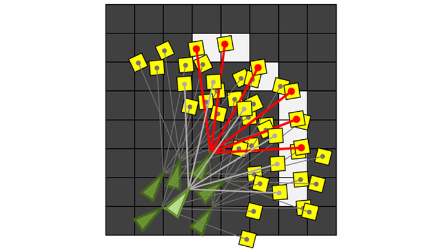
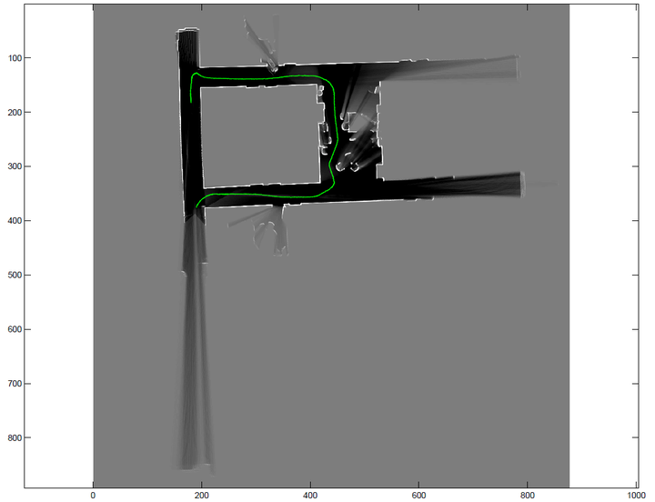

## Bayesian Estimation - Localization

善始善终，这篇文章是Coursera课程[Robotics: Estimation and Learning](https://link.zhihu.com/?target=https%3A//www.coursera.org/learn/robotics-learning)最后一周的课程总结。里面的小哥讲得不是很清晰，留下的作业很花功夫（第二周课程也是酱紫）。

这周讲的是使用蒙特卡罗定位法（Monte Carlo Localization，也作Particle Filter Localization）进行机器人定位（Localization）。这篇总结分为两部分：

- 问题介绍和算法步骤
- 使用雷达数据进行的小实验

## **1. 蒙特卡罗定位**

在[第三周](https://zhuanlan.zhihu.com/p/21738718)中，我们讲到了机器人在不知道地图却知道自己位置的情况下如何利用传感器信息构建地图（Mapping）。在这一周中，我们的问题相反，机器人知道地图信息的情况下如何利用传感器信息确定自己的位置（Localization）。

有人会说，定位是不需要地图信息的。机器人知道初始位置，知道左右轮的速度，就可以算出在一段时间内左右轮分别走了多少距离，进而算出机器人的转角和位移，以便更新位置信息。但是显然，这种方法存在很大的问题。首先，速度是传感器获得的，然而传感器是有精度限制的，这就意味着误差的存在，对时间积分求距离误差就更大了；另外，机器人也可能存在打滑之类的机械问题。

结合地图来对机器人进行定位能有效减小误差。

和第三周课程类似，我们使用激光传感器，它能够测量机器人各个方向和最近障碍物之间的距离。在每一个时间点，机器人都会获得激光传感器的测量值。如下图，绿色三角形是机器人，红色的线是激光束，黄色的格子是机器人在该激光方向上检测到的最近的障碍物。


地图是第三周中的占据栅格地图（Occupancy Grid Map）。比如，下面的地图中，浅色（白色）的格子表示障碍物，深色（黑色）的格子表示空白位置。


那么，在这个时间点，我们要做的就是把机器人放到地图中去，使得激光传感器的读数尽可能符合地图信息（如下图所示）。



这样，对于一个时间点的定位问题就变成了求解最优函数的问题了。然而这个最优化函数太难求解了（坐标和角度都是连续变化的，而地图是一个一个格子的数值）。

我们需要注意到两点。第一，对于给定的机器人位置信息，我们可以很轻松地计算出和地图的吻合程度；第二，相邻两个时间点机器人位置的变化不会太大。基于这两点，我们引出蒙特卡罗定位法。这个算法的核心思想是用高斯分布描述机器人位置信息的噪音，用大量的粒子来描述机器人可能的位置。

具体来说，假如估测的机器人位置信息为 $$[x, y, \theta]$$ ( $$x$$和 $$y$$表示坐标，$$\theta$$表示机器人朝向)，我们会记录机器人的位置信息符合 $$\mu = [x, y, \theta]$$ , $$\Sigma$$视具体情况而定）的多元高斯分布（见[第一周](./gaussian_model.html)的内容）。在算法实现中，我们用高斯分布采样出的 $$M$$个粒子来表示机器人的位置。如下左图所示的单元高斯模型，下面蓝色的点是采样的粒子，上面是对应的高斯分布的模型；如下右图所示是二元高斯模型采样的情况。


蒙特卡罗定位法分为四步：


下面，我们将结合具体例子来说明算法的步骤。


## **2. 实践：利用激光传感器定位**

前面我们介绍了为什么使用蒙特卡洛法进行机器人定位以及大体步骤，在这一节我们将介绍算法实现的具体细节。我们需要编写matlab函数：

```matlab
function [ myPose ] = particleLocalization(ranges, scanAngles, map, param)
```

scanAngles是$$K\times 1$$的数组，表示同一时间发射的 $$K$$ 束激光与机器人前进方向的夹角。ranges是$$K\times N$$的矩阵，表示$$N$$个时间点的激光传感器数据。map是$$R\times C$$的矩阵，表示已知的占据栅格地图。param是一个结构体，包含一些必要的输入，其中param.resol表示分辨率，即一米的方格数量，param.origin是在占据栅格地图中的起始位置。我们需要计算出一个$$3\times N$$的矩阵myPose，机器人在$$N$$个时间点的坐标和朝向。

第一步，初始化粒子群。由于初始位置已经给出了准确值（param.origin），我们只需要设定种群大小$$M$$之后利用repmat方法复制 $$M$$个初始位置作为初始种群。在实际应用（比如SLAM）中，如果初始位置不确定，可以使用高斯分布随机采样的方法（randn函数）初始化粒子群。

第二，模拟粒子运动。在[第二周](https://zhuanlan.zhihu.com/p/21692854)中，我们讲了利用卡尔曼滤波为机器人运动建模，这是实际应用中一种十分有效的方法。在这里，我们采用一种简单粗暴的方法，不对机器人运动进行建模，直接假定机器人在两个采样的时间点间隔内运动的范围有限，然后利用randn函数随机生成可能运动到的位置。

第三，计算粒子评分。对于每一条激光射线，传感器读数与地图的匹配有四种情况如下表。


我实践的时候发现，雷达定位出的空白区域太多了，计算这些栅格十分耗时，所以只计算传感器定位的障碍物与地图中障碍物的符合个数（即上表的评分改为0，0，0，+1）。对每一个粒子评分结束后，我们选择得分最高的粒子作为该时间点机器人的位置。

第四，粒子群重采样。在评分结束后，我们会发现有的粒子评分很低，即严重偏离可能位置，对于这些粒子我们需要舍弃。而有一些粒子的评分很高且很接近（比如传感器读数与地图吻合度80%以上的粒子），我们需要把它们都保留下来。这就是粒子群重采样。在实际操作中，我们直接将评分过低的粒子舍弃，对评分高的粒子进行复制，重采样之后保持粒子群数量基本不变。

完整的matlab代码为：

```matlab
function myPose = particleLocalization(ranges, angles, map, param)

% occupancy value of unexplored pixels
unknown = mode(reshape(map, size(map,1)*size(map,2), 1));

N = size(ranges, 2); % number of poses to calculate
myPose = zeros(3, N); % initialize return value

resol = param.resol; % map resolution
origin = param.origin; % origin in pixel

sig = [0.08, 0, 0; 0, 0.08, 0; 0, 0, 0.08]; % noise for particle movement

myPose(:,1) = param.init_pose; % init position

M = 200; % number of particles

P = repmat(myPose(:,1), [1, M]);

thr = ceil(3.5/5*size(angles,1)); % set the score threshold as 70%

for j = 2:N
    maxscore = 0;
    while maxscore < thr
        Q=P+(randn(size(P,2),3)*sig)'; % particles movement
        score = zeros(size(Q,2), 1); % scores
        for k = 1:size(Q,2) % calculate score for each particle
            occ_x = ceil( (ranges(:,j) .* cos(angles+Q(3,k)) + Q(1,k) )  * resol + origin(1) );
            occ_y = ceil( (-ranges(:,j) .* sin(angles+Q(3,k)) + Q(2,k) ) * resol + origin(2) );
            ids = occ_x > 0 & occ_x <= size(map,2) & occ_y > 0 & occ_y <= size(map,1);
            score(k) = size( map( map (sub2ind(size(map), occ_y(ids), occ_x(ids)) ) > unknown ), 1);
        end
        [maxscore, index] = max(score); % select particle with maximum score
    end
    myPose(:,j) = Q(:,index); % set pose(j) as the optimal particle

    Q = Q(:,score >= thr); % select particles with high score
    P = repmat(Q, 1, ceil(M/size(Q,2)) ); % regenerate particles
end

end
```

于是，我们就得到了测试数据的定位图了：



**总结**

本周讲了经典的定位算法——蒙特卡罗定位法，最早的论文可见"[Monte Carlo localization for mobile robots](https://link.zhihu.com/?target=http%3A//www.cc.gatech.edu/ai/robot-lab/online-publications/dellaert_frank_1999_2.pdf)"，这种方法十分实用。当然，我们只讲了地图已知的情况下如何定位。**在地图未知的时候，Mapping和Localization需要同时进行，也就是SLAM，这四个步骤就会有很多变化，但是算法的框架并不会变。**

对于这整个课程来说，感觉第一周和第三周的课讲得特别清晰，课后的练习都能很轻松地干掉。尤其是第一周讲的高斯分布，内容很多却讲得很清楚。第二周和第四周的内容都只讲了大概，很多细节留到了作业中要自己去揣摩。作业做起来有些蛋疼，需要反复理解，但其中算法的思想都是十分经典的。值得一上！