## Mapping

写在前面：这篇文章是Coursera上的课程（[Robotics: Estimation and Learning](https://link.zhihu.com/?target=https%3A//www.coursera.org/learn/robotics-learning/home/week/3)），权当笔记，激光传感器的数据可以在课程内下载。**这一周的内容比较简单，但十分实用。**

[占据栅格地图（Occupancy Grid Map） - 知乎 (zhihu.com)](https://zhuanlan.zhihu.com/p/21738718)

在这片文章中，我们将会介绍：

- 机器人世界的几种地图；
- 占据栅格地图的表示方法与更新方法；
- 利用激光传感器数据构建占据栅格地图。

## **1. 机器人地图的分类**

地图有很多种表示方式，例如，用经纬度标识地方的世界地图，城市的地铁图，校园指引图。

第一种我们称为**尺度地图（Metric Map）**，每一个地点都可以用坐标来表示，比如北京在东经116°23′17''，北纬39°54′27''；第二种我们称为**拓扑地图（Topological Map）**，每一个地点用一个点来表示，用边来连接相邻的点，即图论中的图（Graph），比如从地铁路线图中我们知道地铁红磡站与旺角东站和尖东站相连；第三种我们称为**语义地图（Semantic Map）**，其中每一个地点和道路都会用标签的集合来表示，例如，有人问我中山大学教学楼E栋在哪里，我会说在图书馆正门右手边靠近图书馆的一侧。

在机器人领域，尺度地图常用于定位于**地图构建（Mapping）**、定位（Localization）和同时定位与地图构建（Simultaneous Localization And Mapping，SLAM），拓扑地图常用于路径规划（Path Planning），而语义地图常用于人机交互（Human Robot Interaction）。

这节课我们将介绍如何用机器人传感器数据绘制尺度地图。这有什么难点呢？首先也是最重要的一点，传感器数据有噪音。用激光传感器检测前方障碍物距离机器人多远，不可能检测到一个准确的数值。如果准确值是 $$\sqrt{2}$$ 米，有时会测出1.42米，有时甚至1.35米。另外，传感器数据是本地坐标系的，而机器人要构建的是一个全局的地图。最后，机器人会运动，运动也是有噪音的。总结起来就两个字，**噪音**。通俗点来讲，“不准”。

在 [Gaussian Model](./gaussian_model.html) 中，我们详细提到了如何对噪音进行建模，用的是概率分布（高斯分布）。在这篇文章中，我们同样利用“概率”这一神奇的数学武器来处理机器人Mapping的问题。

## **2. 占据栅格地图**

我们首先来介绍机器人Mapping用到的的传感器，它叫做**激光传感器（Laser Sensor）**，如下图所示：


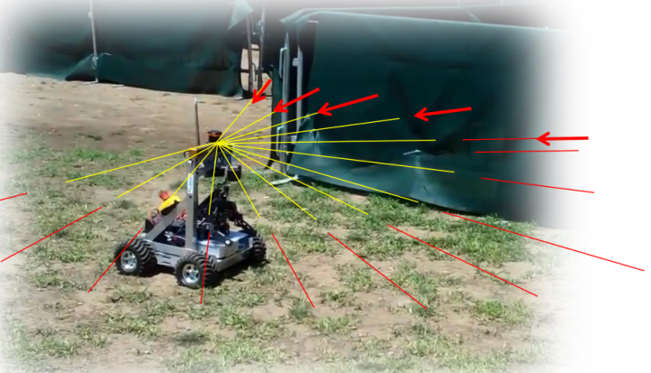

激光传感器会向固定的方向发射激光束，发射出的激光遇到障碍物会被反射，**这样就能得到激光从发射到收到的时间差，乘以速度除以二就得到了传感器到该方向上最近障碍物的距离。**


这样看来，似乎利用激光传感器，机器人能够很好地完成Mapping这一任务。但是我们前面提到了，**传感器数据是有噪音的**。例如，**假如我们在此时检测到距离障碍物4米，下一时刻检测到距离障碍物4.1米，我们是不是应该把4米和4.1米的地方都标记为障碍物？**又或者怎么办呢？

为了解决这一问题，我们引入**占据栅格地图（Occupancy Grid Map）**的概念。

我们首先来解释这里的占据率（Occupancy）指的是什么。

在通常的尺度地图中，***对于一个点***，**它要么有（Occupied状态，下面用1来表示）障碍物**，**要么没有（Free状态，下面用0来表示）障碍物**。

在占据栅格地图中，对于一个点，我们用$$p(s=1)$$来表示它是Free状态的概率，用$$p(s=0)$$来表示它是Occupied状态的概率，当然两者的和为 $$p(s=0)+ p(s=1) = 1$$。简化后，两者的比值来作为点的状态 (思考 $$Odd(s)$$ 越大代表什么)：
$$
Odd(s)=\frac{p(s=1)}{p(s=0)}
$$

对于一个点，新来了一个测量值（Measurement，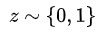）之后我们需要更新它的状态 (表示$$z_t = 0$$ 或者 $$z_t = 1$$)。

假设测量值来之前 (你可以认识是 $$s_{t-1}$$ )，该点的状态为 $$Odd(s)$$，于是下一个时刻 $$s_t$$：
$$
Odd(s|z)=\frac{p(s=1|z)}{p(s=0|z)}
$$
这种表达方式类似于条件概率，表示在 $$z_t$$ 发生的条件下 $$s_t$$ 的状态。

根据贝叶斯公式，我们有：

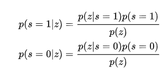

带入之后，我们得

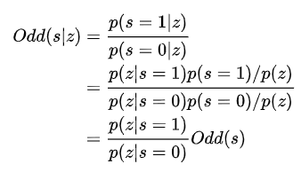

我们对两边取对数得：

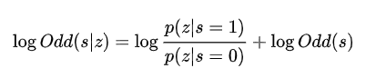

这样，含有测量值的项就只剩下了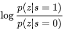。我们称这个比值为测量值的模型（Measurement Model），标记为 
$$
lomeas = \log\frac{p(z|s=1)}{p(z|s=0)}
$$
测量值的模型 $$lomeas$$ 只有两种：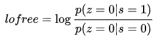和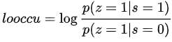，而且都是定值。

这样，如果我们用$$log \ Odd(s)$$来表示位置$$s$$的状态$$S$$的话，我们的更新规则就进一步简化成了：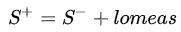。

其中 $$S^{+}$$  和 $$S^{-}$$ 分别表示测量值之后和之前 $$s$$ 的状态。

**另外，在没有任何测量值的初始状态下，一个点的初始状态** (薛定谔的占据？)

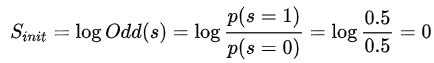。


经过这样的建模，**更新一个点的状态就只需要做简单的加减法**了。这，就是数学的魅力。

例如，假设我们设定 $$looccu=0.9$$，$$lofree=-0.7$$。那么， 一个点状态的数值越大，就表示越肯定它是Occupied状态，相反数值越小，就表示越肯定它是Free状态。


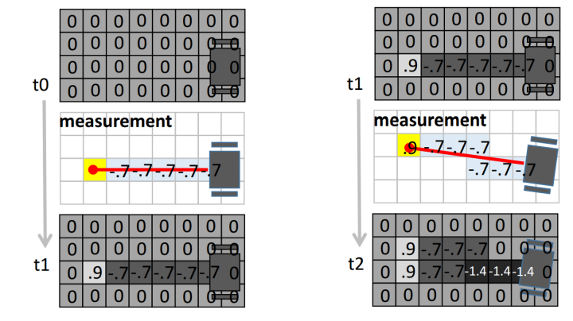

上图就展示了用两个激光传感器的数据更新地图的过程。在结果中，一个点颜色越深表示越肯定它是Free的，颜色越浅表示越肯定它是Occupied的。


## **3. 利用激光传感器构建占据栅格地图**

前面讲到通常用激光传感器数据来构占据栅格地图，这一节我们将详细介绍其中的实现细节。具体来说，我们需要编写函数：

```text
function myMap = occGridMapping(ranges, scanAngles, pose, param)
```

其中，scanAngles是一个 $$N\times1$$的数组，表示激光传感器的$$N$$个激光发射方向（与机器人朝向的夹角，定值）；ranges是一个$$K\times N$$的数组，表示 $$N$$ 个时间采样点激光传感器的读数（距离障碍物的距离）；pose是一个 $$3\times N$$的数组，表示 $$N$$个时间采样点机器人的位置和朝向信息（前两维为位置，第三维为朝向角度）；param是一些传入的参数，param.origin是机器人的起点，param.lo_occ和param.lo_free分别是第二节中的 $$looccu$$和 $$lofree$$，param.max和param.min表示位置状态的阈值（超过则置为阈值边界），**param.resol表示地图的分辨率，即实际地图中一米所表示的格点数目**，param.size表示地图的大小。

首先，我们解决如何将真实世界中的坐标转化为栅格地图中的坐标。

考虑一维的情况：

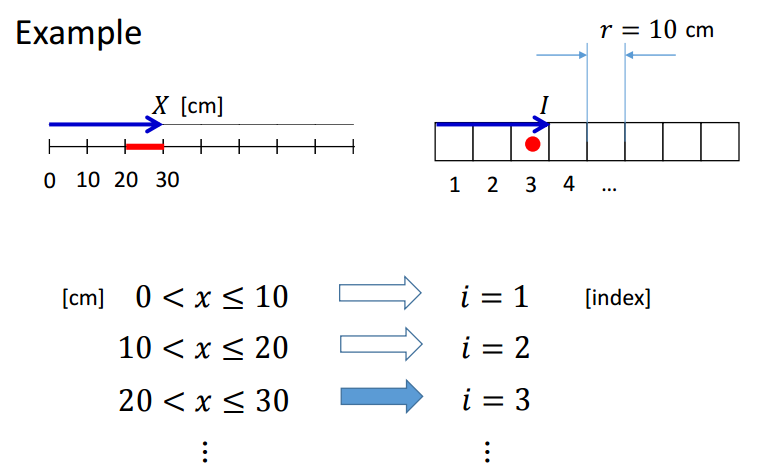

图中$$x$$是真实世界中的坐标，$$i$$为离散化了的地图（栅格地图）中的坐标，$$r$$为一格的长度，$$1/r$$表示分辨率，显然我们有：
$$
i = ceil(x/r)
$$


同理，二维情况下：
$$
(i, j) = (ceil(x/r), ceil(y/r))
$$


其次，我们来计算每一条激光所检测出的障碍物和非障碍物在栅格地图中的位置。

假设机器人的状态为 $$(x, y, \theta)$$，激光与机器人朝向的夹角为 $$\alpha$$，测量的障碍物的距离为 $$d$$（途中未标明$$\alpha$$，不好意思）：


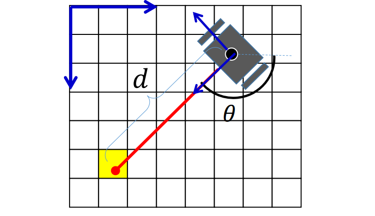

计算障碍物所在点的实际位置：
$$
x_o = d\cos(\theta+\alpha)+x \\
y_o = d \sin(\theta+\alpha) + y
$$
再计算障碍物在栅格地图中的位置 $$(i_o, j_o)$$，以及机器人在栅格地图中的位置$$(i, j)$$。根据这两个坐标可以使用[Bresenham算法](https://link.zhihu.com/?target=https%3A//en.wikipedia.org/wiki/Bresenham%27s_line_algorithm)来计算非障碍物格点的集合。

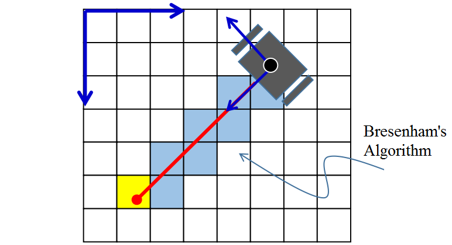

最后，利用第二节中的结论，我们使用简单的加减法不断更新格点的状态即可。

完整的Matlab代码如下：

```matlab
function myMap = occGridMapping(ranges, scanAngles, pose, param)

resol = param.resol; % the number of grids for 1 meter.
myMap = zeros(param.size); % the initial map size in pixels
origin = param.origin; % the origin of the map in pixels

% Log-odd parameters 
lo_occ = param.lo_occ;
lo_free = param.lo_free;
lo_max = param.lo_max;
lo_min = param.lo_min;

lidarn = size(scanAngles,1); % number of rays per timestamp
N = size(ranges,2); % number of timestamp

for i = 1:N % for each timestamp
    theta = pose(3,i); % orientation of robot
    % coordinate of robot in real world
    x = pose(1,i);
    y = pose(2,i);

    % local coordinates of occupied points in real world
    local_occs = [ranges(:,i).*cos(scanAngles+theta), -ranges(:,i).*sin(scanAngles+theta)];

    % coordinate of robot in metric map
    grid_rob = ceil(resol * [x; y]);

    % calc coordinates of occupied and free points in metric map
    for j=1:lidarn
        real_occ = local_occs(j,:) + [x, y]; % global coordinate of occ in real world
        grid_occ = ceil(resol * real_occ); % coordinate of occ in metric map

        % coordinates of free in metric map (by breshnham's algorithm)
        [freex, freey] = bresenham(grid_rob(1),grid_rob(2),grid_occ(1),grid_occ(2));

        % convert coordinate to offset to array
        free = sub2ind(size(myMap),freey+origin(2),freex+origin(1));
        occ = sub2ind(size(myMap), grid_occ(2)+origin(2), grid_occ(1)+origin(1));

        % update metric map
        myMap(free) = myMap(free) - lo_free;
        myMap(occ) = myMap(occ) + lo_occ;
    end
end

% reassign value if out of range
myMap(myMap < lo_min) = lo_min;
myMap(myMap > lo_max) = lo_max;
```

使用课程给的数据，我们最终画出下面这样的占据栅格地图（用灰度图显示出来　的）：

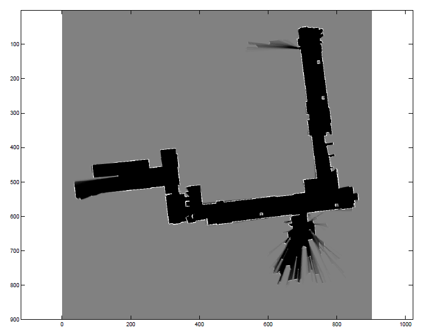

结语：地图构建（Mapping）是机器人领域的一个重要问题，本文介绍了占据栅格地图的表示方法和利用激光传感器构建占据栅格地图的方法。但是，我们不难发现，使用的数据中机器人的位置和朝向是给定的。然而在实际的应用中，机器人不仅需要为未知环境构建地图，还要在未知环境中定位（Localization）以完成其他任务。我们发现，Mapping和Localization是相辅相成、不可分割的两部分，这就是同时定位与地图构建（SLAM）问题，机器人领域中的一个重要问题。