## Bayesian Estimation - Target Tracking

最近在看Coursera的[robotic learning](https://link.zhihu.com/?target=https%3A//www.coursera.org/learn/robotics-learning/home/week/2)，发现挺有意思的。这里算是做一下week 2的用卡尔曼滤波来做机器人目标追踪的笔记，紧接着上一篇的[《从高斯分布、机器人误差、EM算法到小球检测》](https://zhuanlan.zhihu.com/p/21648507)。

[目标追踪之卡尔曼滤波 - 知乎 (zhihu.com)](https://zhuanlan.zhihu.com/p/21692854)

这篇小文章主要有两个内容

1. 怎样用一个卡尔曼滤波对一个线性动力系统进行建模以及求解
2. 做一个小球追踪的小实验

## **卡尔曼滤波建模**

**滤波，简要来说就是如何过滤掉收到干扰的信号**。卡尔曼滤波所做的是从一堆观测数据中，去估计出真实数据样子。举一个简单的例子，就说机器人的目标追踪。人感知这个世界靠的是眼睛，机器人感知这个世界靠的是传感器。机器人通过传感器测量物体位置的时候，**传感器可能带来测量误差**。例如，上一篇利用高斯分布来检测小球的文章，我们很有可能由于遮挡、模型的精度不够导致我们测量的小球中心的位置会有些许误差。**例如下图中，我们测量的可能是带有噪声的黑点，那么真正的轨迹究竟是如何的呢？**

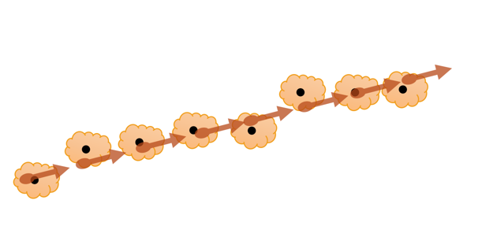

我们把我们所关心的真实的小球当前的状态称之为**状态（State）x**，传感器测量得到的小球位置称之为**测量值（Measurement）z**。其中，**x为隐含变量** (学过隐马尔科夫链应该会明白什么是隐含变量)。


＃ 由于看的公开课学的kalman filter，所以文章中用到的数学符号大部分跟随课件。

＃ 另外是Coursera这门课上讲课的那个小哥的ppt总是感觉写的不太严谨，所以这里我另外自己推导了一下。

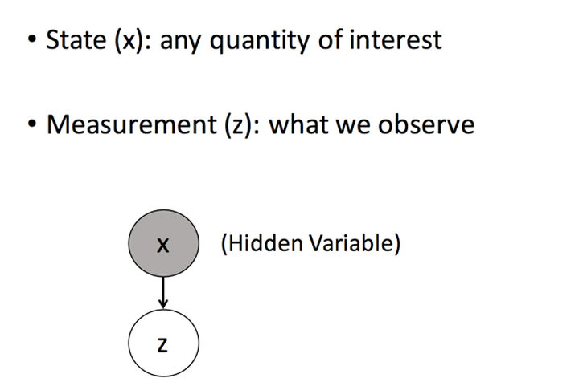

**所有的模型最重要的开始就是它的假设**，卡尔曼滤波的**第一个假设是当前的状态只与前一个状态相关**(马尔科夫链)。用数学表达是

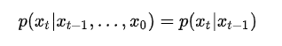

接下来是卡尔曼滤波的第二个假设，由于我们对真实的状态并不知道，所以我们估计的状态实际上都**有一定的不确定性**，**而这种不确定性我们用高斯分布的均值以及方差来表示**。对于上一个状态 $$x_{t-1}$$，假设我们估计其均值为$$\hat{x}_{t-1}$$, 方差为 $$\hat{P}_{t-1}$$。则有

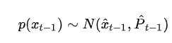 (1)

(**~**为**约等于**。 以 $$\hat{x}_{t-1}$$ 为中心，方差为 $$\hat{P}_{t-1}$$ 的高斯分布， 注意到方差需要自己设定)

根据离散动力系统的构造(线性系统， State Space 应该经常看到) ，我们能得到$$x_{t}$$与$$x_{t-1}$$的关系

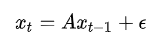 (2)

其中**A为系统的状态转移矩阵**，$$\epsilon$$ **代表系统误差并服从高斯分布** (也是马尔科夫链的知识，多次马尔科夫链相乘会得到什么？)。 在我们的小球追踪实验中，x为小球的位置以及速度，A矩阵则是根据位移以及速度的关系构造。

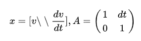

由公式(1)，**假设误差服从0中心，方差为 $$\Sigma_m$$ 的高斯分布**。我们可以得出 $$p(x_t|x_{t-1})$$服从以 $$Ax_{t-1}$$ 为中心，方差为 $$\Sigma_m$$ 的高斯分布。

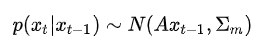 (3)

那么我们可以根据公式(1)和公式(3)，计算出 $$p(x_t)$$ 的边缘概率分布。

其边缘概率分布服从

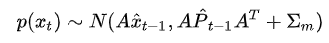 （5）

**懒得推导可以根据PRML这书的这一页纸直接得到结论**，需要详细推导的话可以看看书（PRML第二章）。


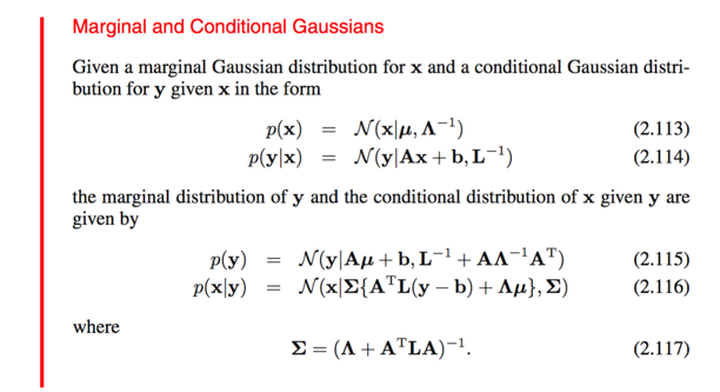

接下来是对观测值建模，观测值 $$z_t$$与 $$x_t$$关系，则为

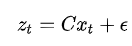 (6)

这里C是从真实值到观察值的状态转移矩阵，$$\epsilon$$为观测误差并服从 $$N(0, \Sigma_0)$$的高斯分布。则同理，$$p(z_t|x_t)$$服从$$Cx_t$$为中心，$$\Sigma_0$$为方差的高斯分布。

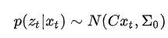 (7)

我们的目标是希望**最大化后验概率**。

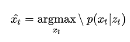

说人话的话，**就是一开始当我们还没观测到结果，我们就有$$x_t$$在此时刻的状态大概是怎么样的情况，也就是先验**。**如今当我们观测到了结果$$z_t$$，我们需要如何修正$$x_t$$的概率分布呢？**我们需要求解的就是去求得 $$p(x_t|z_t)$$。为了计算的方便，我们先定一些符号

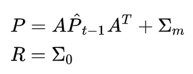

根据贝叶斯公式（或者直接套用上面PRML的图），我们可以直接得出后验概率为

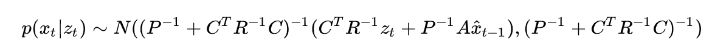

那么估计值 $$\hat{x}_t$$应该为高斯分布的均值

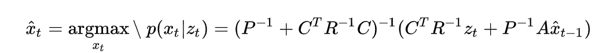

而估计值的方差则为

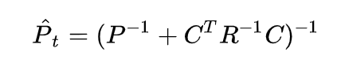

为了表达上的优美，我们将$$\hat{x}_t$$的公式做一下变换

先给出一个**矩阵逆定理**

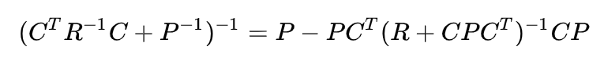

我们令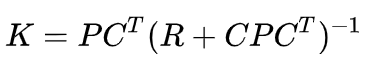

那么

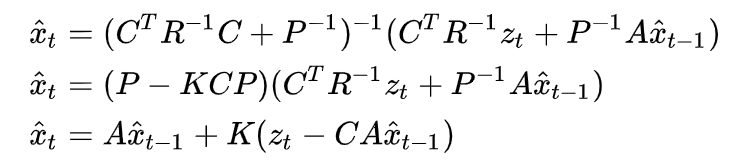

我们可以这么理解上面这一条公式，$$A\hat{x}_{t-1}$$应该为 t 时刻中，没有观察值预测到的状态。

$$z_t -CA\hat{x}_{t-1}$$ 为预测的观察值与实际观察值的差距。然后通过一个$$K$$来调整最终的$$\hat{x}_t$$估计值。所以 $$K$$ 在卡尔曼滤波中，有一个特殊的意义，叫做**卡尔曼增益。**


整个卡尔曼滤波的算法基本如下：

1. 设定初始状态的均值和方差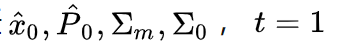
2. 接受下一个观测值 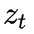
3. 计算方差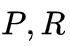，以及卡尔曼增益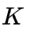
4. 更新估计值的方差以及均值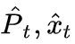
5. 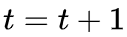，回到2


## **实战：小球追踪实验**

这次的仿真实验给出了小球每一帧的运动轨迹，我们需要在每一个时刻中预测出小球在10帧之后位置，具体的要求见[Requirement](https://link.zhihu.com/?target=https%3A//www.coursera.org/learn/robotics-learning/programming/KTx26/kalman-filter-tracking)。


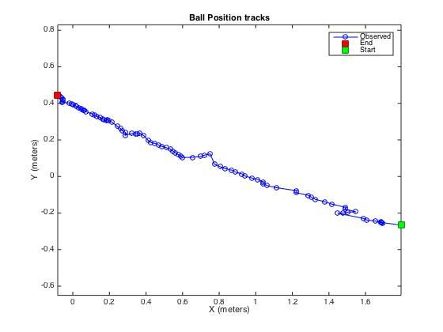

小球的轨迹如上图所示，为了做对比，我们引入一种最朴素的算法作为估计。对于每一时刻的 $$x_t$$，我们估计它的速度为


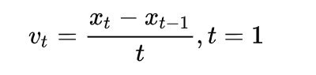

那么十帧之后，它的位置估计为

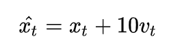

我们把这种方法叫做Naive Prediction。

另外的一个方法，就是我们的卡尔曼滤波。首先，我们假定**x轴与y轴是相互独立的**。卡尔曼滤波中的状态我们设定为x轴，y轴坐标，以及x轴方向与y轴方向的速度。

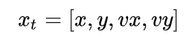

A状态转移矩阵根据位移以及速度的关系为

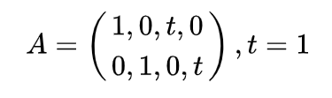

我们假定观测的$$z_t$$实际上是状态 $$x_t$$在10帧之前的位置。则 $$C$$ 矩阵为

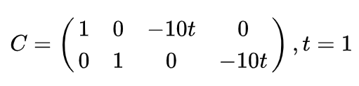

建立好动力系统后，接下来是对卡尔曼滤波的参数进行初始化，由于一开始我们并不知道初始状态的位置，所以我们可以把第一个观测值当作我们初始状态，然后加上一个**较大的初始方差**。剩下的系统误差的方差以及观测误差的方差则需要自己慢慢的调试了。具体的matlab代码如下

```matlab
function [ predictx, predicty, state, param ] = kalmanFilter( t, x, y, state, param, previous_t )
%UNTITLED Summary of this function goes here
%   Four dimensional state: position_x, position_y, velocity_x, velocity_y

    %% Place parameters like covarainces, etc. here:
    sigm =  eye(4);
    sigo =  1e-3*eye(2);
    dt = t- previous_t;
    A = [1 0 dt 0 ;0 1 0 dt;0 0 1 0;0 0 0 1];
    C = [1 0 -10* dt 0;0 1 0 -10*dt];
    % Check if the first time running this function
    if previous_t<0
        state = [x,y,0,0];
        param.P = 10 * sigm;
        param.R =  sigo;
        predictx = x;
        predicty = y;
        return;
    end
    param.R = sigo;
    P = A*param.P*A'+ sigm;
    K = P*C'/(param.R+C*P*C');
    state = A*state'+ K*([x,y]'-C*A*state');
    state = state';
    param.P = P - K*C*P;
    predictx = state(1);
    predicty = state(2);
    return
end
```


由于预测的10帧后的轨迹会与上图的轨迹重合，为了更好地可视化出我们的目标，我们另外将x轴和y轴抽取出来单独画图。

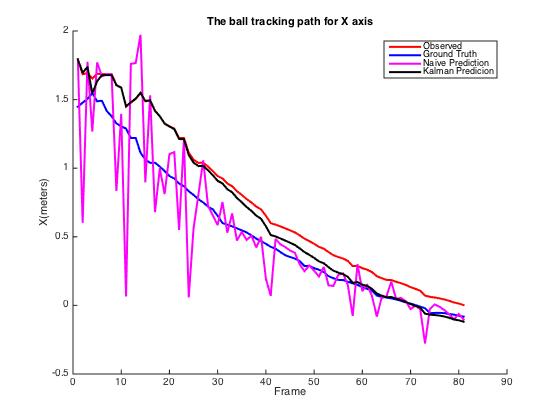


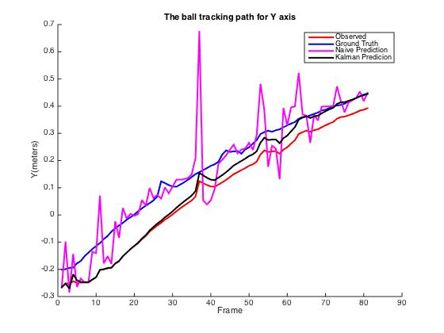


上图是x轴以及y轴的追踪效果，其中红线代表每一时刻的观测值，蓝线是10帧之后我们需要预测的答案。下图为每一时刻的误差。我们能发现，朴素方法的预测得到的估计值十分不稳定，而卡尔曼滤波的估计值却能比较平滑的接近于真实状态的曲线。


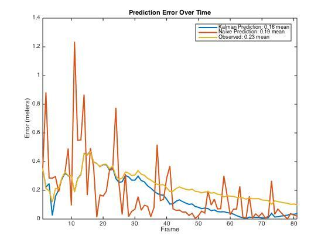

这里算是告一段落了，这篇文章只是粗略地介绍一下卡尔曼滤波算法，以及做了一个小仿真实验。在我个人看来，卡尔曼滤波算法中，有很多人为设定的东西，例如A、C两个状态转移矩阵，还有不同的方差设定。要能准确的调节这些参数，我觉得最重要的一点就是理解算法的本身，理解每一个假设还有求解中间的过程。这也是我之所以比较多的写中间卡尔曼滤波推导过程的原因，最好还是自己动手做一做。欢迎讨论～


=====================================================

写于2016年8月23日

补充一下的推导，主要还是参考《Probabilistic Robotics》里面的推导公式。只是照搬书上的公式，套回来这里用的数学符号。

